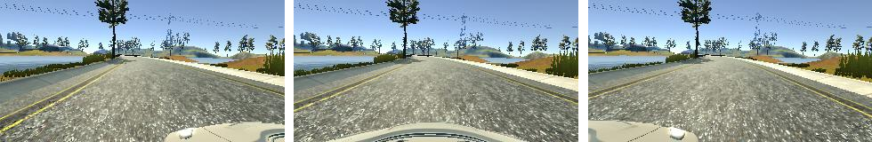
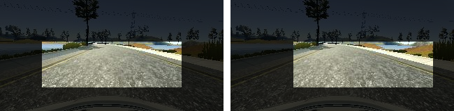

Behavioral Cloning for Udacity Self Driving Car Nanodegree Program
==================================================================

This repository contains code and a Keras CDNN model for project 3 of term 1 of
the Udacity Self Driving Car Nanodegree program.


About the Dataset
-----------------

Initially, I attempted to train on the Udacity dataset, but found that the dataset
was too small and did not capture nearly enough of the track to be useful. Nvidia
used 72 hours of driving data to train Dave2. I wasn't going to be able to get
that much data, but I certainly needed more.

The dataset consists of all three images (left, center, right) from driving
several laps around Track 1 of the simulator using an Xbox 360 gamepad. Most
of the driving was "normal" driving, i.e. I drove down the center of the road.
I also captured a few "recoveries" in which I start recording with the car near
the edge of the road, and drove back to the center.

To get more data for training, I augmented the simulator data in two ways.
First, I used all three images from the car. I offset the steering angle for
the left and right cameras by 0.25. Second, I generated images with a random
horizontal translation or "jitter" and offset the steering angle by 0.008 per
pixel of shift.



Example training images from the left, center, and right cameras.



Example of a training image with (r) and without (l) jitter.

About the Model Architecture
----------------------------

For this project, I chose to use [Nvidia's Dave2 architecture](https://devblogs.nvidia.com/parallelforall/deep-learning-self-driving-cars/), which has been proven to work in the real world.
Another popular option is George Hotz's architecture from comma.ai, but I did
not test it because the Nvidia architecture is more proven and I had more
confidence in the design.

The Dave2 architecture, with only nine layers, is fairly compact. I was able to
train fairly large batch sizes (128+ samples) on an NVidia Geforce GTX 1060 GPU
with 6 GB of memory. The first three layers are 5x5 convolutional filters with
valid padding. These successive convolutions shink the image size while
increasing the image depth from 3 RGB input layers to 48 feature channels. Note
that the input to this network is RGB color, as opposed to YUV or another color
space. A color space transformation is mathematically equivalent to a 3x1x1
convolutional layer, and any color space transform is easily learned by a
network of this size, including transforms to novel color spaces. After the
first three layers of 5x5 convolutions, there are two more convolutional
layers, this time with 3x3 filters. These layers further increase the depth
to 64 channels and blend the features into high-level features, each one a
1x18 vector.

The 64 high level feature vectors are then fed into a series of 4 fully-connected
hidden layers. The output of the final layer is fed into a single output neuron.
The output neuron has no activation function (its output is linear), allowing
it to output any scalar value (rather than saturating its value to 0 or 1, as
in a classification task). This scalar value is the steering angle.

I experimented with both Rectified Linear Unit (ReLU) and Exponential Linear
Unit (ELU) for the nonlinearity in the network. I didn't find a strong
difference between the two, and ultimately chose to use ELU because it does not
completely discard negative activation like ReLU does, which seems significant
in non-classification tasks like this.

This diagram from NVidia illustrates the layout of the Dave2 architecture:


Data Preprocessing
------------------

Properly preprocessing the data is key to sucess on this project. The Dave2
architecture expects smaller input images (200x66) than the simulator
generates (320x160). Initally, I used scaling to downsize the images. However,
scaling by this factor distorts the images and introduces some terrible aliasing.
Instead, I started cropping the images to an area of interest that excluded the
sky and the hood of the car. This had two advantages over scaling: it avoids
aliasing problems and also cuts out features that aren't salient to the
processing task (the sky, the peripheral areas, and the hood of the car). Also,
because my cropped image was narrower than the full image, I was able to simply
slide the cropping box from left to right over the image to augment my data with
jittered images.

Finally, the input images were normalized. This was actually done as the first
layer of the model to take advantage of GPU processing in Keras. The normalization
subtracts the mean of each channel, resulting in a zero-mean image. The, each
channel is divided by the maximum absolute value in the channel, guaranteeing
that every value is in the range [-1.0, 1.0].

Training the Model
------------------

The model was trained for 10 epochs over this dataset, which, with augmentation,
totaled 231630 per epoch. I used the Adam optimizer with Mean Squared Error as
a loss function. I monitored both the training loss and the loss of
a validation set that I recorded separately. I found that the validation
loss was almost meaningless, dropping after the first epoch and then holding
steady as the training loss improved. In spite of this, I found that training
more (even as the validation loss had saturated), still resulted in real
improvement when the model was tested in the simulator. I suspect that because
my validation set was recorded separately, and because there are so many
"correct" ways to drive the train, the dataset was different enough from the
training set that it was not a good metric for the model.

To help combat overfitting, I applied dropout to the fully-connected layers
and set the dropout rate to 0.25. I chose to only apply dropout to the later
layers in the pipeline because the effects of dropout should propagate backwards
through the model. (This advice was given to me by a coworker who works with
DCNNs regularly.)

```
usage: model.py [-h] --batch-size BATCH_SIZE --epochs EPOCHS --optimizer
                OPTIMIZER [--dropout DROPOUT] --loss LOSS
                [--data-dir DATA_DIR [DATA_DIR ...]] [--verbose]
                --validation-dir VALIDATION_DIR
                [--metrics [METRICS [METRICS ...]]]

optional arguments:
  -h, --help            show this help message and exit
  --batch-size BATCH_SIZE, -b BATCH_SIZE
                        Number of samples in each batch
  --epochs EPOCHS, -e EPOCHS
                        number of training epochs
  --optimizer OPTIMIZER, -o OPTIMIZER
                        One of the Keras optimizers
  --dropout DROPOUT, -x DROPOUT
                        Dropout rate [0,1.0]
  --loss LOSS, -l LOSS  One of the Keras loss functions
  --data-dir DATA_DIR [DATA_DIR ...], -d DATA_DIR [DATA_DIR ...]
                        Data directories to use
  --validation-dir VALIDATION_DIR, -v VALIDATION_DIR
                        Data directory to use for validation
```

This model was trained with this command:

```
python model.py -b 128 -e 10 -o adam -l mse -x 0.25 -v my_data -d my_data_2
```

Running the Controller
----------------------

The controller is very similar to the template provided by Udacity, with a few
small changes. I added the same preprocessing described above, and I applied an
[exponential smoothing filter](https://en.wikipedia.org/wiki/Exponential_smoothing)
with alpha=0.1 to the steering command because I noticed that the steering
output was very jittery. The smoothing filter helps keep the car from swerving
back and forth. To run the controller, simply provide it with the path to the
model.json file:

```
python drive.py model.json
```

Files
-----

In addition to the two core executables, drive.py and model.py, most of the
supporting python code is in the behavioral_cloning directory, which contains
two python modules:

- behavioral_cloning/generators.py contains various generators for reading data
    from the driving log and from images. This includes all of the data
    augmentation code.
- behavioral_cloning/model.py contains the definition of the model in keras, as
    well as the custom layer for normalization and the preprocesing function,
    which crops the image.

There are also two utility executables, plot_data.py, for plotting training
data with matplotlib for easy visualization, and plot_model.py, for plotting
the model predictions of a set of training data, which makes it easy to see
how well the model fits the data.

System Requirements
-------------------

The minimum system requirements are unknown, but all development and testing
work was performed on this system:

| Component | Specification                            |
| --------- | ---------------------------------------- |
| CPU       | Intel Core i5-2500K                      |
| GPU       | Nvidia GeForce GTX 650 (displays)        |
| GPU       | Nvidia GeForce GTX 1060 (cUDA processor) |
| RAM       | 8GB DDR3                                 |
| Drive     | Samsung SSD 850 EVO 250GB                |

Future Work
-----------

This model is somewhat intentionally overfit. It was designed to drive on track
one, and it can succeed at that task, but the model does not generalize at all.
It cannot go very far on track two before crashing into the rock wall. In order
to make a model like this perform in more environments, I would have to
train it on more data. I could probably reduce the raw data requirements by
adding simulated lighting (shadows and color) to the data augmentation. However,
that is beyond the scope of this project.

Credits
-------

Tip of the Hat to

- [Vivek Yadav](https://medium.com/@vivek.yadav) and [Nick Hortovanyi](https://about.me/hortovanyi)
  for their ideas on data augmentation, which inspired my own approach.
- [The NVidia End to End Deep Learning Team](https://devblogs.nvidia.com/parallelforall/deep-learning-self-driving-cars/), who created the Dave2 architecture and created the diagram used above.
